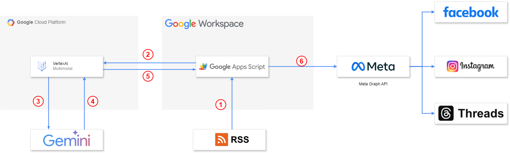

# rss-auto-post-facebook-with-gemini
Auto Facebook post system with Gemini and fetching RSS source

> Use Gemini to summarize Google Blog articles and output them in a specified format, and automatically schedule them for publication through the Meta API. Reduce the time cost of operating a fan page and the information gap in cross-language information delivery, while increasing the audience and participation of the fan page, and improving the promotion effect of future activities.

## System Flow


# How to get permanent API KEY of facebook api?

1. How to create a permanent access key
For the approach I found you need a Facebook Business account that has access to the page you want a key for.

You then need to create a system user as detailed here: Add system user. The following may not be 100% accurate, as my Facebook is in German and thus everything Facebook related is in German as well. (At the time of writing the below is accessible via business.facebook.com/settings)

Go to your Business Account Dashboard
Go to Settings (Left bottom corner, the cog)
Go to More Business Settings or Advanced Settings (The cog, 4th point, beneath Business Assets)
Go to Users > System User
Here you can add a system user. Once this is done, you can assign assets (the app and the page you want the key for) and permissions. You can now generate an access key which will be permanent. This key needs to be copied and saved, as it will not be available later on in the interface i.e. it is not saved by Facebook.

You now have a permanent user access key!

2. Get long live access key (60 Days)
```
curl --location 'https://graph.facebook.com/oauth/access_token?grant_type=fb_exchange_token&client_id={CLIENT_ID}&client_secret={CLIENT_SECRET}&fb_exchange_token={API_TOKEN}' \
--header 'Cookie: ps_l=0; ps_n=0'
```

API Responase
```
{
    "access_token": "{60-DAYS-TOKEN}",
    "token_type": "bearer"
}
```

3. GET Get permanent access key 
```
curl --location 'https://graph.facebook.com/{FACEBOOK_PAGE_ID}?fields=access_token&access_token={60-DAYS-TOKEN}' \
--header 'Cookie: ps_l=0; ps_n=0'
```
API Response
```
{
    "access_token": "{API_KEY}",
    "id": "{FACEBOOK_PAGE_ID}"
}
```

# How to get IG business account ID?
```
curl --location 'https://graph.facebook.com/v20.0/{FACEBOOK_PAGE_ID}?fields=instagram_business_account&access_token={API_KEY}' \
--header 'Cookie: ps_l=1; ps_n=1'
```

API Responase
```
{
    "instagram_business_account": {
        "id": "{IG_PAGE_ID}"
    },
    "id": "{FACEBOOK_PAGE_ID}"
}
```

# How do I get stuff for Threads API ?
You can follow these reference as tutorial:
* [Come on！使用 Threads API 來自動發文吧](https://cowton0517.medium.com/come-on-%E4%BD%BF%E7%94%A8-threads-api-%E4%BE%86%E8%87%AA%E5%8B%95%E7%99%BC%E6%96%87%E5%90%A7-792797a68437#da53)
* [Threads API Official Document](https://developers.facebook.com/docs/threads?source=post_page-----792797a68437--------------------------------)

# Add Google Auth to Google App Script

## Connecting to a Google API
If you are trying to connect to a Google API from Apps Script you might not need to use this library at all. Apps Script has a number of easy-to-use, built-in services, as well as a variety of advanced services that wrap existing Google REST APIs.

Even if your API is not covered by either, you can still use Apps Script to obtain the OAuth2 token for you. Simply edit the script's manifest to include the additional scopes that your API requires. When the user authorizes your script they will also be asked to approve those additional scopes. Then use the method ScriptApp.getOAuthToken() in your code to access the OAuth2 access token the script has acquired and pass it in the Authorization header of a UrlFetchApp.fetch() call.

Visit the sample NoLibrary to see an example of how this can be done.

## Setup
This library is already published as an Apps Script, making it easy to include in your project. To add it to your script, do the following in the Apps Script code editor:

Click on the menu item "Resources > Libraries..."
In the "Find a Library" text box, enter the script ID `1B7FSrk5Zi6L1rSxxTDgDEUsPzlukDsi4KGuTMorsTQHhGBzBkMun4iDF` and click the "Select" button.
Choose a version in the dropdown box (usually best to pick the latest version).
Click the "Save" button.
Alternatively, you can copy and paste the files in the /dist directory directly into your script project.

If you are setting explicit scopes in your manifest file, ensure that the following scope is included:

https://www.googleapis.com/auth/script.external_request
Redirect URI


